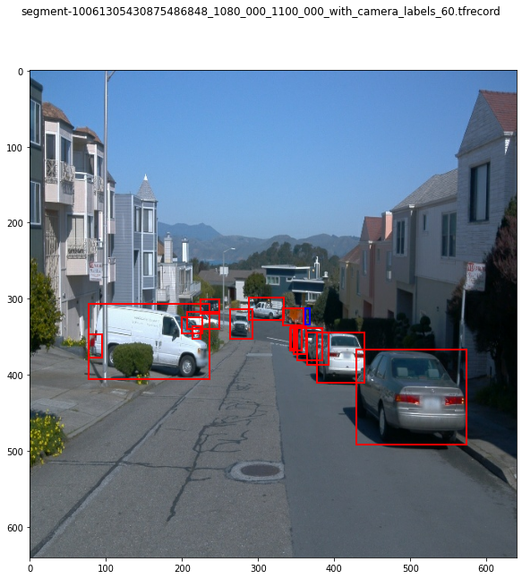

### Project overview
Waymo released it's self driving car dataset. In this project, we will use the waymo dataset, with tensorflow object detect api, to train a new model to detect vehicles, pedestrians, and cyclists.

### Set up
0) Download Google Cloud SDK
```
curl https://sdk.cloud.google.com | bash
gcloud auth login
```

1) Download tfrecords and convert the camera images to 640x640. I've shortened the list of files to be downloaded and processed. This is due to disk space constraints (in Udacity workspace) for processing images and training.
```
python download_process.py --data_dir /home/workspace/data/ --temp_dir /home/backups/
```

2) Split the tfrecords into training/validation/testing
```
python create_splits.py --data_dir /home/workspace/data/
```

3) Use the following script to edit the config file
```
python edit_config.py --train_dir /home/workspace/data/training/ --eval_dir /home/workspace/data/val/ --batch_size 4 --checkpoint ./training/pretrained-models/ssd_resnet152_v1_fpn_640x640_coco17_tpu-8/checkpoint/ckpt-0 --label_map label_map.pbtxt
```

### Training and validation
4. Train the model
```
python experiments/model_main_tf2.py --model_dir=training/reference --pipeline_config_path=./pipeline_new.config --checkpoint_every_n=100
```

5. Evaluate the model
```
python experiments/model_main_tf2.py --model_dir=training/reference/ --pipeline_config_path=./pipeline_new.config --checkpoint_dir=training/reference
```

### Export and interface
6. Export the model so we can interface with it
```
python experiments/exporter_main_v2.py --input_type image_tensor --pipeline_config_path training/reference/pipeline_new.config --trained_checkpoint_dir training/reference/ --output_directory training/reference/exported_model/
```

7. Create a video of the model drawing bounding boxes around cars, pedestrians, and bikes
```
python inference_video.py --labelmap_path label_map.pbtxt --model_path training/reference/exported_model/saved_model --tf_record_path /home/workspace/data/testing/segment-10231929575853664160_1160_000_1180_000_with_camera_labels.tfrecord --config_path training/reference/exported_model/pipeline.config --output_path animation.gif
```
### Dataset
#### Dataset analysis
The waymo dataset contains files that holds recordings of frames (images) from the camera and data from lidar. We show the image with bounding boxes, graph of number of vehicles/pedestrians/bicycles in 1 frame, number of recordings with certain weather conditions, and finally, number of recordings with time of day.

Here are some images from the 30 recordings from waymo dataset





Here are graphs of number of vehicles/pedestrians/bicycles in a frame


Here's a graphs of weather for all 30 waymo dataset I've selected


Here's a graphs of time of day for all 30 waymo dataset I've selected


#### Cross validation
For cross validation, I choose to do 10% for validation, 10% for testing, and 80% for training. I chose these values because I want to more images for training. I can shuffle images for later training so that any image used for testing/validation can be used for training later.

#### Training
Due to GPU and space limitions on Udacity's workspace (and GPU is expensive on the cloud), I was only able to train 200 steps. We used 11 recordings for training. The Udacity workspace closes itself after about 2 hour of training. 

Here's the loss during train. The x-axis is steps and y-axis is loss. This uses **momentum optimizer with cosine decay learning rate**.


#### Validation
For validation, I used PASCAL VOC 2010 detection metric (pascal_voc_detection_metrics) because COCO detection metrics (coco_detection_metrics) was not working on Udacity's workspace.

Here's the loss for validation. The x-axis is steps and y-axis is loss. Since we only trained 200 steps, naturally the validation is loss is very high.


The x-axis is steps and y-axis is number of boxes above 0.5 iou (intersection over union). Since we only trained 200 steps, naturally the iou validation is very poor. The number of iou above 0.5 is is 0 for all categories.


### Improvements
| Name                     | Description |
| -----------              | ----------- |
| batch_size               | Increasing the batch size will improve the loss but cannot confirmed due to GPU limitions on Udacity's workspace |
| num_steps                | Increasing the number of steps will improve the loss but cannot confirmed due to GPU and time limitions on Udacity's workspace |
| random_adjust_brightness | Adjusting brightness of an image will add another image to the dataset to simulate day/night time |
| feature_extractor -> type | There are other type of pre-train model we can use. For this experiment, we used **ssd_resnet152_v1_fpn_keras** |
| eval_config -> metrics_set | There are other evaluation metrics that can be used, such **pascal_voc_detection_metrics** and **coco_detection_metrics** |
| optimizer | There are other optimizers that can be used, such as **adam_optimizer** and **momentum_optimizer** |

Using **Adam optimizer with learning rate 0.001**, there are improvements in training. Here's the tensorflow charts

As you can see, the loss is slowly going down whereas the loss was stuck at 2 using **momentum optimizer with cosine decay learning rate**.

### Argumentation
We randomly adjust brightness for argumentation. We did this to simulate day/night for the selected image.

original


brighten image


darken image

